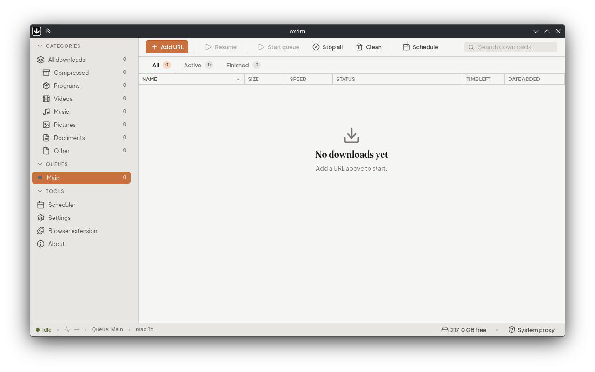

<div align="center">

<picture>
  <source media="(prefers-color-scheme: dark)" srcset="assets/oxdm_about_light.png">
  
</picture>

<h1>oxdm</h1>

<p>Download manager for Linux, macOS and Windows.<br>
One binary, no runtime to install.</p>

<p>
  <a href="https://github.com/jd1378/oxdm/releases/latest"></a>
  <a href="https://github.com/jd1378/oxdm/actions/workflows/ci.yml"></a>
  <a href="LICENSE"></a>
  
</p>

<picture>
  <source media="(prefers-color-scheme: dark)" srcset="assets/oxdm_screenshot_dark.png">
  
</picture>

</div>

## Features

- **Lightweight UI.** Drawn in software: no GPU, no toolkit. Every window is its own process and opens in about 90 ms.
- **Scheduled queues.** Run on a timetable, or only under conditions you pick: unmetered connection, AC power, an idle machine. When a run ends it can notify you, run a command, or shut the machine down.
- **Segmented downloads.** A file is split across connections.
- **Browser capture.** Downloads arrive from the extension with their cookies, headers and referrer, over WebSocket or native messaging.
- **Resilient.** Interrupted parts resume, and failures retry on a fixed-then-exponential backoff that you can configure.
- **Per-job settings.** Proxy, credentials, headers, cookies and checksum, with speed limits set globally or per job.
- **Easy updates.** It tells you a release is out; you download and install it from About.

## Install

### Linux / macOS

```bash
curl -fsSL https://raw.githubusercontent.com/jd1378/oxdm/main/tools/install.sh | sh
```

Downloads the release archive for your platform, checks it against the
published SHA-256, installs `oxdm` and `oxdm-native-host` into
`~/.local/bin`, and adds a launcher entry.

Custom directory:

```bash
curl -fsSL https://raw.githubusercontent.com/jd1378/oxdm/main/tools/install.sh | sh -s -- --dir /usr/local/bin
```

### Windows

```powershell
irm https://raw.githubusercontent.com/jd1378/oxdm/main/tools/install.ps1 | iex
```

Installs to `%LOCALAPPDATA%\Programs\oxdm`, adds it to your user PATH, drops a Start-menu shortcut.

### Build from source

```bash
git clone https://github.com/jd1378/oxdm
cd oxdm
cargo build --release --bins
```

No system dev libraries are needed beyond a C toolchain. Everything
that talks to the desktop (tray, notifications, keyring, network and
power state) goes over D-Bus in pure Rust, so there is nothing to
install for it.

Outputs:

- `target/release/oxdm`: main app
- `target/release/oxdm-native-host`: browser native-messaging bridge

For development there is also `cargo run -p oxdm-testserver`, a local
server whose endpoints each misbehave in one specific way (no ranges,
unknown length, wrong checksums, ranges advertised but ignored). Its
index page at `http://127.0.0.1:8088/` lists them. It is a separate
workspace member, so release builds do not include it.

## Uninstall

Linux / macOS:

```bash
curl -fsSL https://raw.githubusercontent.com/jd1378/oxdm/main/tools/uninstall.sh | sh
# also wipe settings + queue DB
curl -fsSL https://raw.githubusercontent.com/jd1378/oxdm/main/tools/uninstall.sh | sh -s -- --purge
```

Windows:

```powershell
irm https://raw.githubusercontent.com/jd1378/oxdm/main/tools/uninstall.ps1 | iex
# also wipe settings + queue DB
$env:OXDM_PURGE = "1"; irm https://raw.githubusercontent.com/jd1378/oxdm/main/tools/uninstall.ps1 | iex
```

## Browser extension

oxdm exposes a stable host-side contract (see [`docs/EXTENSION_API.md`](docs/EXTENSION_API.md)) but does not ship an extension itself. Both transports are supported:

- **WebSocket** at `ws://127.0.0.1:<port>`, simplest for development.
- **Native messaging** via the `oxdm-native-host` shim plus a per-OS manifest.
  oxdm registers the manifest itself: on first run, again whenever it
  finds one missing or stale, and on demand from *Settings → Browser
  integration*. `oxdm --install-native-host [--chromium-id ID]` does
  the same from a terminal.

The pairing code the extension asks for lives in *Settings → Browser integration*, with Copy and Regenerate buttons. It bundles the port and the auth token in one string.

## Configuration

Settings + queue persist in a SQLite DB:

| OS      | path                                                   |
|---------|--------------------------------------------------------|
| Linux   | `~/.config/oxdm/oxdm.db`                               |
| macOS   | `~/Library/Application Support/oxdm/oxdm.db`           |
| Windows | `%APPDATA%\oxdm\oxdm.db`                               |

Every `odl::config::Config` field is editable from Settings, plus oxdm-only knobs (theme, IPC port, conflict-while-hidden behavior, remove-confirm prompts).

## Architecture

Four-layer clean architecture (`domain` → `data` → `ipc_local` → `gui`):
`domain` is pure, [`odl`](https://crates.io/crates/odl) types never leak
past `data`, and the GUI windows are separate processes that talk to the
daemon over a local socket. Pause/cancel and the update channel sit
behind traits, so swapping either does not touch the UI. The desktop UI
is built with [iced](https://iced.rs).

## License

Copyright (C) 2026 jd1378

GNU Affero General Public License v3.0. See [LICENSE](LICENSE).

This program is free software: you can redistribute it and/or modify it
under the terms of version 3 of the GNU Affero General Public License as
published by the Free Software Foundation. Later versions of that
license do not apply. It is distributed WITHOUT ANY WARRANTY; without
even the implied warranty of MERCHANTABILITY or FITNESS FOR A PARTICULAR
PURPOSE. See the GNU Affero General Public License for more details.
